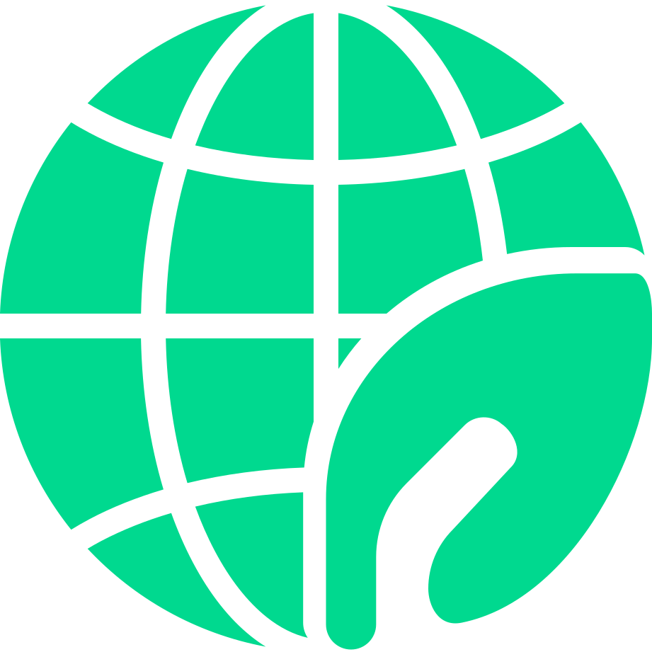

<div align="center">
    <p align="center">
        
        <h3 align="center">How Green?</h3>
        <a href="https://how-green.herokuapp.com" target="_blank"></a>
        <a href="https://github.com/ineshbose/how-green/actions/workflows/test-vue.yml" target="_blank"></a>
        <a href="https://github.com/ineshbose/how-green/actions/workflows/test-api.yml" target="_blank"></a>
    </p>
</div>

How Green? is an application, created for the Human Computer Interaction (H) Coursework, aiming to provide awareness about green shopping.

## Getting Started

### Prerequisites

#### Cloning this Repository

To clone this repository, you need to have [Git](https://git-scm.com/) installed, however you can also download a [ZIP](https://github.com/ineshbose/how-green/archive/master.zip) instead.

```sh
$ git clone https://github.com/ineshbose/how-green.git
$ cd how-green
```

#### Node.js & NPM/Yarn

This project uses two Node.js frameworks, and in order to run those, you need to have [Node.js](https://nodejs.org/en/download/) installed which will include `npm`. Furthermore, it is **strongly recommended** to install [Yarn](https://classic.yarnpkg.com/lang/en/); issues with `npm` are not to blamed here.

```sh
$ npm install --global yarn
# Make sure npm bin is in your PATH, eg (C:\User\...\AppData\Roaming\npm)
```

#### Python & PIP

You should have [Python 3](https://www.python.org/downloads/) already installed that also uses the package manager `pip`.

```sh
$ python --version  # or python3 --version
$ pip --version     # or pip3 --version or python -m pip --version
```

##### Virtual Environment

It is good practice that you create a virtual environment before hand to install packages and get the project running.

```sh
$ python -m venv env        # name env
$ source env/bin/activate   # or env\scripts\activate.bat on Windows
```

### Frontend

```sh
$ yarn              # or npm install
$ yarn run serve    # or npm run serve
```

### Backend

```sh
$ pip install -r requirements-dev.txt
$ python run.py
```

### Extension

```sh
$ cd extension
$ yarn              # or npm install
$ yarn run start    # or npm run start
```

The extension will be in `dist/` with `manifest.json` that can be added to your browser.

### Dev References

* [MDN Web Docs](https://developer.mozilla.org/en-US/docs/Mozilla/Add-ons/WebExtensions)
* [Chrome Developers](https://developer.chrome.com/docs/extensions/mv3/getstarted/)
* [`flask-vuejs-template`](https://github.com/gtalarico/flask-vuejs-template)
* [`react-typescript-chrome-extension-boilerplate`](https://github.com/sivertschou/react-typescript-chrome-extension-boilerplate)

## Developed With

- [Flask](https://flask.palletsprojects.com/en/2.0.x/)
- [Flask-RESTX](https://flask-restx.readthedocs.io/en/latest/)
- [React](https://reactjs.org/)
- [React-Bootstrap](https://react-bootstrap.github.io/)
- [Vue](https://vuejs.org/)
- [BootstrapVue](https://bootstrap-vue.org/)
- [Chart.js](https://www.chartjs.org/)

## Team Members

- Anna Berry
- Hector Jones
- Inesh Bose
- Marc Auf der Heyde
- Stephen Connolly
